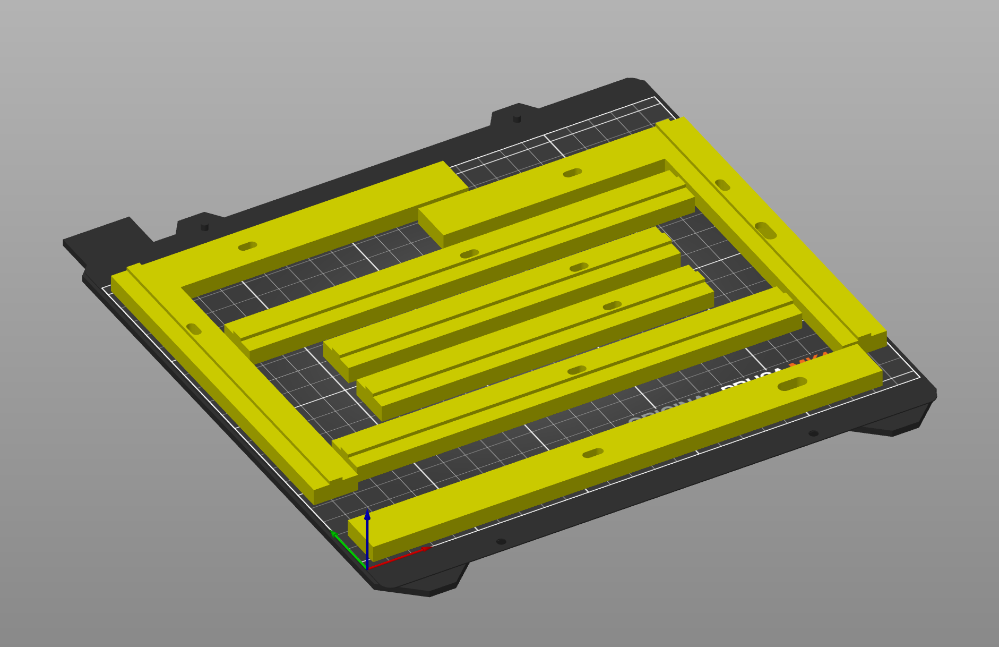
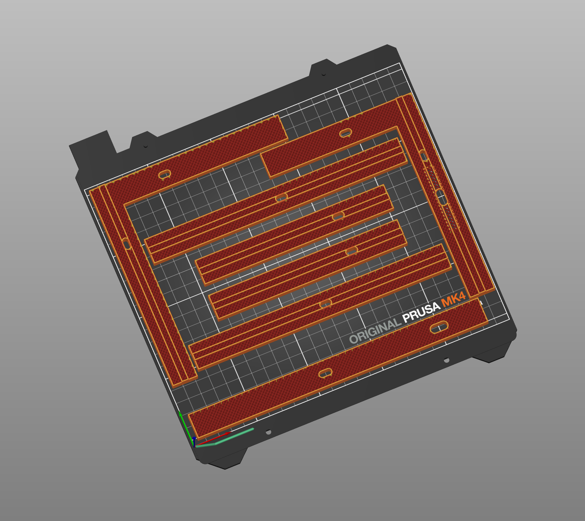

# Acrylic Panels
Enclosed printers like the Troodon 2.0 Pro are designed to help keep the chamber temperature both constant and elevated. And, when printing with noxious filaments like ABS or ASA, they also help to direct the air through active carbon filters, reducing the smell that makes it out into the surrounding environment. For many such printers, these are just 3mm acrylic panels cut to size with pre-drilled holes for mounting. There may or may not be foam strips to go between the acrylic and the printer frame. 

## Panel Rubbing
Typical 3mm acrylic panels like those found in the Troodon 2.0 Pro, have a softening temperature of 94C. During normal printing, the chamber temp will typically reach only half that temperature, so this isn't a huge concern. However, panels can warp in or out very slightly. With the tight tolerances inside the chamber, this can lead to some rubbing against the back panel when the gantry moves up and down, or the side panels when the gantry moves forward and back. 

A quick way to deal with rubbing on the side panels that have warped inward is to flip them around.

## The Rear Panel

The original Troodon 2.0 Pro design leaves a minimal gap between the rear acrylic panel and the gantry. Very often, the X/Y belts touch the rear panel and resonate against it; the gantry may also scratch the panel. An easy or temporary solution is to use thicker foam between the panel and the printer, but it's impossible at the bottom since the panel slides into a designated place.

The better solution is to print inserts that add ~7.5mm of clearance and mount the panel through the inserts. Unfortunately, it means that longer screws are required for everything, for the panels, for the filament sensor, and for the spool holder.

The inserts can be printed with no top/bottom solid layers to save plastic and increase elasticity. I printed with 2 walls, 0 top/bottom layers, 20% rectilinear infill.

_Credit: @Miyconst from Formbot's #troodon_2 channel_

## Files
- [`Back Panel Inserts-TopMiddle.3mf`](../../3D_Files/RearPanelInserts/Back_Panel_Inserts-TopMiddle.3mf): the horizontal insert at the middle top, need one.
- [`Back Panel Inserts-TopLeft.3mf`](../../3D_Files/RearPanelInserts/Back_Panel_Inserts-TopLeft.3mf): the top left corner insert, need one.
- [`Back Panel Inserts-TopRight.3mf`](../../3D_Files/RearPanelInserts/Back_Panel_Inserts-TopRight.3mf): the top right corner insert, need one.
- [`Back Panel Inserts-SideMiddle.3mf`](../../3D_Files/RearPanelInserts/Back_Panel_Inserts-SideMiddle.3mf): the vertical insert at the middle, need two, one for each side.
- [`Back Panel Inserts-SideBottom.3mf`](../../3D_Files/RearPanelInserts/Back_Panel_Inserts-SideBottom.3mf): the vertical insert at the bottom, need two, one for each side.

## Screenshots

#
Next: [First Problems](https://github.com/500Foods/WelcomeToTroodon/blob/main/docs/level_0/first_problems.md)
